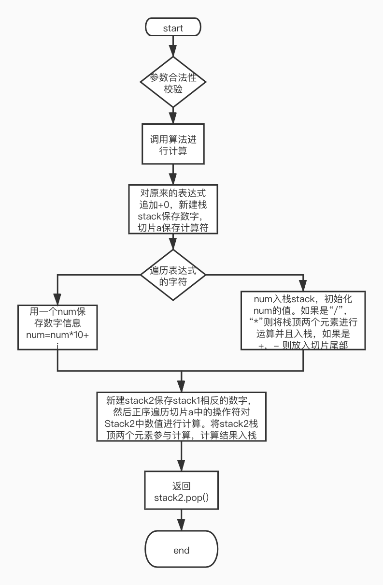

## 项目简介

1、使用Gin框架完成一个接口，实现请求参数为一个只包含正整数、加减乘除的算数表达式，返回表达式的结果。

## 快速上手

1、本项目由Go语言开发，需要配置Go开发环境

2、进入项目根目录，通过命令行命令启动项目

​		1、go build main.go		---编译

​		2、./main 						  ---启动项目

​		3、本项目监听的是8080端口ip地址为localhost

## 目录结构

```tree
├── README.md
├── app
│   ├── main
│   └── main.go
├── go.mod
├── go.sum
├── internal
│   ├── ctrl
│   │   └── calcuCtrl.go
│   ├── globalError
│   │   ├── error.go
│   │   └── errorHandler.go
│   ├── handler
│   │   └── calcuHandler.go
│   ├── router
│   │   └── Route.go
│   └── utils
│       ├── IsLegitimate.go
│       ├── auxiliary.go
│       ├── simpleCal.go
│       └── stack.go
├── locust.py
└── report.html
```

## 代码逻辑分层

| 层     | 文件夹            | 功能                     | 调用关系     | 其他说明     |
| ------ | ----------------- | ------------------------ | ------------ | ------------ |
| 应用层 | /app              | 服务器启动               | 调用路由层   | 不可同层调用 |
| 路由层 | /internal/router  | 路由转发                 | 调用控制层   | 不可同层调用 |
| 控制层 | /internal/ctrl    | 参数校验                 | 调用业务层   | 不可同层调用 |
| 业务层 | /internal/handler | 表达式处理，返回计算结果 | 调用工具层   | 不可同层调用 |
| 工具层 | /internal/utils   | 计算表达式具体算法实现   | 被业务层调用 | 可同层调用   |

## 存储设计

##### 使用自定义栈保存计算信息和中间结果

```go
//SimpleStack 简易版栈，利用切片实现了栈的基础功能入栈和出栈
type SimpleStack struct {
	nodes []int
}
```

## 接口设计

请求方法：HTTP.GET

接口地址：http://127.0.0.1:8080/calculate

请求参数

```json
{
	"exp":"2*19-8/2"
}
```

响应状态码

| 状态码 | 说明         |
| ------ | ------------ |
| 1001   | 表达式不合法 |
| 10011  | 出现非法字符 |
| 10015  | 表达式为空   |

## 第三方库

### gin

```go
go语言的web框架
https://github.com/gin-gonic/gin
```

## todo

拓展支持其他运算符

## 流程图


